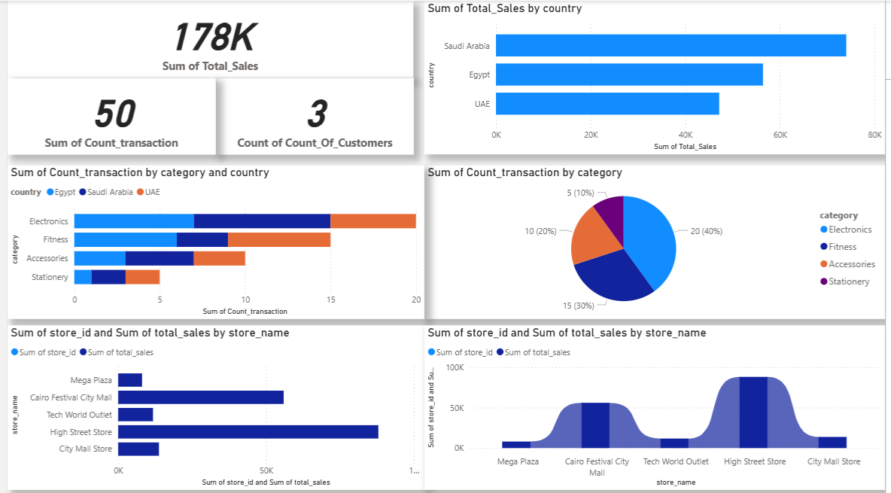
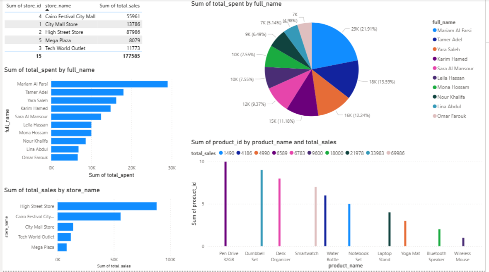

# 🛍️ Retail Analytics Dashboard – Power BI

This project showcases a professional Power BI dashboard built from a retail dataset stored in Azure Data Lake and processed using Apache Spark on Databricks.

## 📊 Dashboard Highlights

- 💰 **Total Sales by Country**
- 🔄 **Transaction Analysis**

---
- 👥 **Customer Distribution**

---
- 🛒 **Top Products & Categories**
- 🏬 **Store Performance**

## 🧱 Data Architecture

- **Bronze Layer**: Raw data from Azure Data Lake (Parquet format)
- **Silver Layer**: Cleaned and joined data using Spark
- **Gold Layer**: Aggregated insights ready for BI

## 📁 Files Included

- `Retails-Taskk.pbix`: Power BI dashboard file
- `Dashboard and Images`: Screenshot of the dashboard
- `Spark Commands.txt` : Apache Spark commands 
- `README.md`: Project documentation

## 🚀 Technologies Used

- Power BI
- Apache Spark (PySpark)
- Azure Data Lake
- Databricks
- Git & GitHub

## 📌 Author

Ahmed Youssef – Data Engineer & Power BI Enthusiast  
[LinkedIn](https://www.linkedin.com/in/your-profile) | [Portfolio](https://your-portfolio.com)

---

Feel free to fork, star, or contribute!
